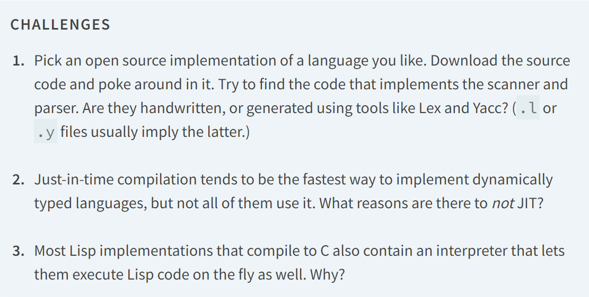

# README
This is an repo for all the code and learnings during my reading of crafting interpreters book 

# TODO
1. ~~Set up Java environment using IntelliJ [see notes](#notes)~~
    1. ~~Watch [Kunal Kushwaha this video on java](https://www.youtube.com/watch?v=4EP8YzcN0hQ&list=PL9gnSGHSqcnr_DxHsP7AW9ftq0AtAyYqJ&index=7) to learn how java works.~~ [Notes - Pending](#how-java-works)
    2. ~~And [This video](https://www.youtube.com/watch?v=TAtrPoaJ7gc&list=PL9gnSGHSqcnr_DxHsP7AW9ftq0AtAyYqJ&index=8) to set up a basic java program~~[Notes - Pending](#how-java-works)
2. ~~Start Chapter 2 of the book~~
3. ~~Start Chapter 3~~
4. Understand tokens and their conversion and do the code for it

# DEVLOG
15/11/24 -> started the journey \
16/11/24 -> watched first video created notebook notes, online pending \
25/11/24 -> completed kunal video in notebook, online pending \
18/12/24 -> started chapter 2 ie part of programming language \
19/12/24 -> completed chapter 2 the repo jlox works in codespaces \
21/12/24 -> completed chapter 3, started chapter 4 understood inital functions for setting up the lexer

# NOTES
## Self Hosting
A compiler reads one file in one language and translates it and outputs it in naother language. We can implement a compiler in any language including same language it compiles to. i.e. I write my compiler in C++ in order to compile the C++ code

## Bootstrapping
the self hosting cannot be done for us right now in this stage, but if we have another comopiler for Lox written in Java, you first use that to compile your compiler once.\
Now you can use the compiled version of your own compiler to compile future versions of itself and the original compiler could be discarded

## How Java works
